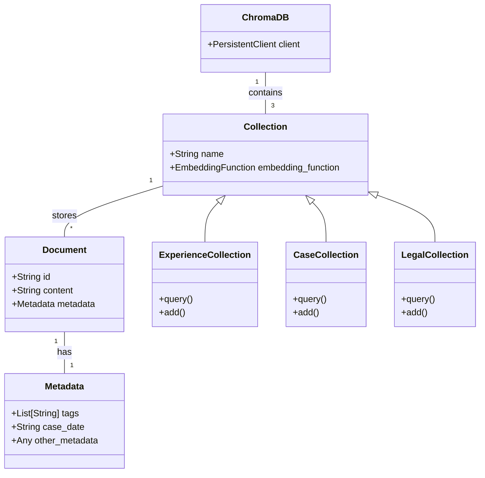

> The below is CAA of 20/02/2025   
> ~ gong

# Dings that I have found from [`AgentCourt`](./AgentCourt/)

<div align="center">
    
    <p><i>POV: You're a visual learner who learns visually through visuals made for learning.</i></p>
</div>

## Question

Look into `db.py` and identify, then modify the retrieval function, prioritize metadata retrieval then KNN retrieval @gong.

## Short answer

Querying within `db.py` specified as methods to the `db` class.

1. `.query_experience()`
2. `.query_experience_metadatas()`
3. `.query_experience_documents()`
4. `.query_case()`
5. `.query_case_documents()`
6. `.query_case_metadatas()`
7. `.query_legal()`

## I am a visual learner

These methods kind of all work in the same way, below is an overview of `.query_experience()`.

```py
def query_experience(self, query_text, n_results=5, include=["documents"]):
    result = self.experience_collection.query(
        query_texts=[query_text], n_results=n_results, include=include
    )
    documents = result.get("documents", [[]])[0]
    return documents[0] if documents else ""
```

* Parameters are `query_text`, `n_results` (default value of 5), and `include` (default value of ["documents"]) 
* Wrapper method itself then extracts only the first document and returns it *(we can just change this for our needs)*
* Uses the generic `.query()` method called on that ChromaDB collection performs the similarity search in the vectorDB 
    * `self.experience_collection` is a ChromaDB collection
    * Filters by `query_texts` which is just the input query text
    * Filters by top `n_results`, right now that's 5 
    * Filters by datatypes specified in `include`, right now that's documents *(can change to include metadatas, distance)*
    * *Can also add the `where` parameter that ChromaDB supports to further filter results, would benefit our tagging system*
    * *Can also add the `threshold` parameter that ChromaDB supports to filter results by similarity score*

## I want to see results! Show me the results!!! Also explain what you did!!! But visually!!! (I'm a visual learner)

See [`modified_db.py`](./AgentCourt/EMDB/modified_db.py).

I added/modified the below methods wahoo.

* `.add_to_case()` 
    * new method
    * accepts `tags` and `case_date` parameters and added to the metadata dictionary
    * if `case_date` provided, it's converted to ISO format and added to the metadata
* `.query_case()` 
    * modified method
    * accepts `query_text`, `tags`, `similarity_threshold`, and `include`
    * creates a `where_clause` to filter by tags if provided
    * queries the case collection with a high `n_results` to get all potential matches
    * filters results based on a similarity `threshold` of 0.7
    * sorts the filtered results by `case_date` most recent first
    * returns a dictionary with sorted documents, metadatas, and distances
* `.query_case_documents()` and `.query_case_metadatas()`
    * modified method
    * use the new `query_case` method with modified parameters
    * allow filtering by tags and similarity threshold

Also I put one mermaid diagram below in case you are a visual learner like me wow i use my eyeballs to visually learn and perceive the universe.

